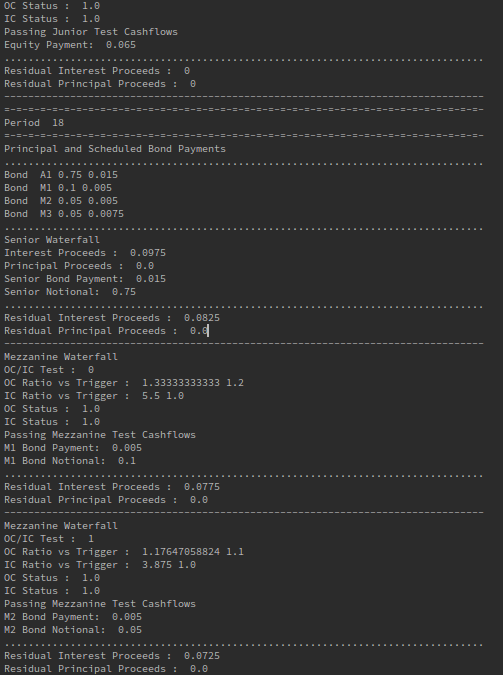

# openSecuritisation

This repository aims to demonstrate a number of technical elements in support of open source securitisation frameworks
* Specifying a structure using a yaml file
* Specifying cashflow operations using lambda functions serialized in a yaml file
* Documenting the cashflow logic using a python file

# Description

The motivation and approach is [described more fully here](https://www.openriskmanagement.com/open-source-securitisation/)

# Dependencies
* ruamel.yaml for parsing and emitting yaml documents that are part of the specification
* numpy for storage and processing of vectors / matrices holding numerical data
* pickle for storage of data / objects not part of the specification